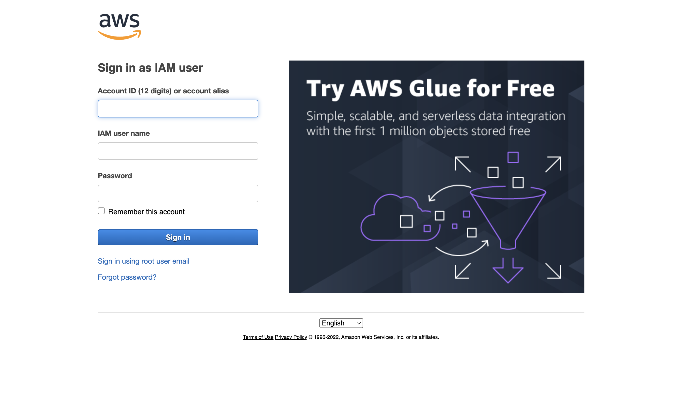
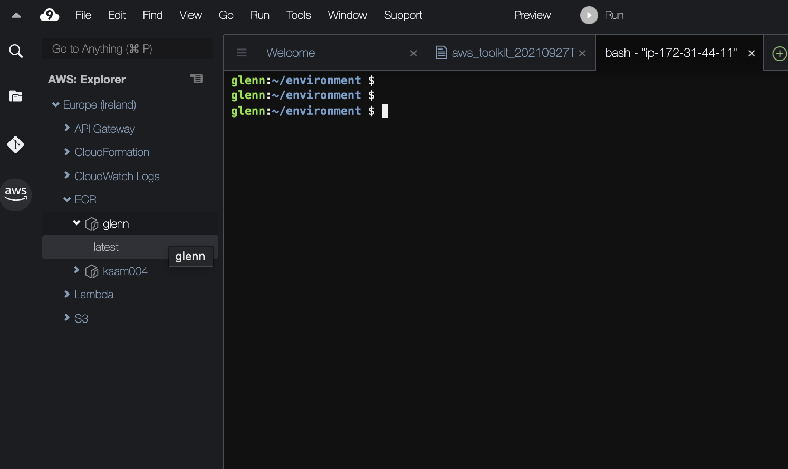
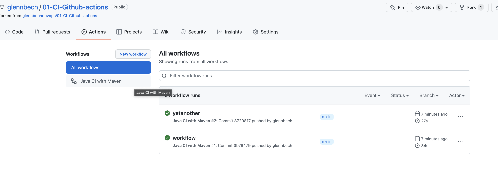
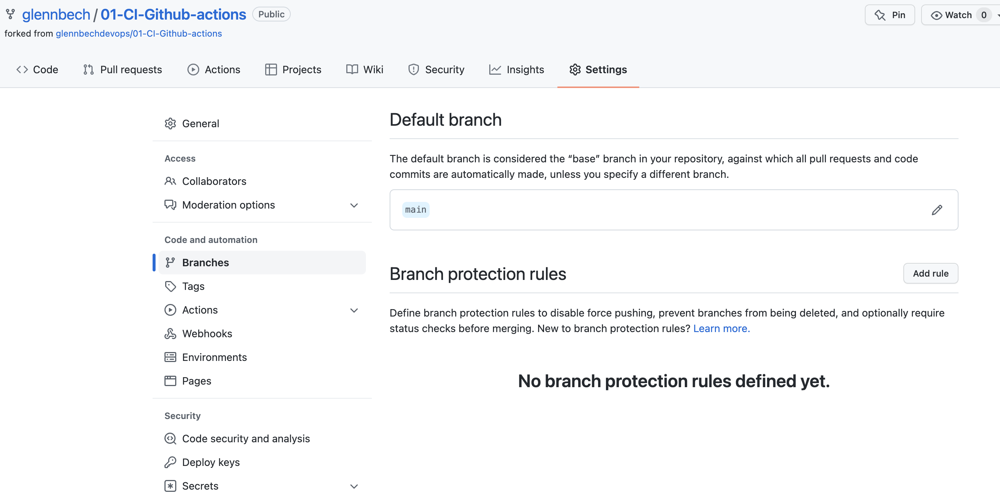

# LAB - CI med GitHub actions 

I denne øvingen skal vi se på viktige prinsipper som 

- GitHib actions
- Trunk based development 
- Feature branch
- Branch protection 
- Pull request

Dere blir også kjent med Cloud 9 utviklingsmiljøet dere skal bruke videre. 

## Før dere starter

- Dere trenger en GitHub Konto
- Lag en fork av dette repositoriet inn i deres egen GitHub konto

### Sjekk ut AWS Cloud 9 miljøet ditt

* Logg på Cloud 9 med en URL gitt i klasserommet, URLen kan feks se slik ut ; 
https://eu-west-1.console.aws.amazon.com/cloud9/ide/f1ffb95326cd4a27af3bd4783e4af974



* Bruk kontonummer 244530008913
* Brukernavnet og passordet er gitt i klasserommet
* Hvis du velger "AWS" ikonet på venstremenyen vil du se "AWS Explorer". Naviger gjerne litt rundt I 
* AWS Miljøet ofr å bli kjent.



Kjør denne kommandoen for å verifisere at Java 11 er installert

```shell
java -version
```
Du skal få 
```
openjdk 11.0.14.1 2022-02-08 LTS
OpenJDK Runtime Environment Corretto-11.0.14.10.1 (build 11.0.14.1+10-LTS)
OpenJDK 64-Bit Server VM Corretto-11.0.14.10.1 (build 11.0.14.1+10-LTS, mixed mode)
```

### Installer Maven i Cloud 9 

```shell
sudo wget http://repos.fedorapeople.org/repos/dchen/apache-maven/epel-apache-maven.repo -O /etc/yum.repos.d/epel-apache-maven.repo
sudo sed -i s/\$releasever/6/g /etc/yum.repos.d/epel-apache-maven.repo
sudo yum install -y apache-maven
```

### Lag et Access Token for GitHub

Når du skal autentisere deg mot din GitHub konto trenger du et access token.  Gå til  https://github.com/settings/tokens og lag et nytt. 


Kryss av for "repo" rettigheter 


### Lage en klone / clone av din Fork av dette repoet i Cloud 9

For å slippe å lime inn Access token hele tiden kan man cache dette i et valgfritt 
antall sekunder.

```shell
git config --global credential.helper "cache --timeout=86400"
```

Lag en klone

```shell
git clone https://github.com/≤github bruker>/01-CI-Github-actions.git
```

* Forsøk å kjøre applikasjonen 
```shell
cd 01-CI-Github-actions
mvn spring-boot:run
```

Start en ny terminal i Cloud 9 ved å trykke (+) symbolet på tabbene


Du kan teste applikasjonen med CURL fra Cloud 9

```
curl -X POST \
http://localhost:8080/account/1/transfer/2 \
-H 'Content-Type: application/json' \
-H 'Postman-Token: e674b4f3-6e48-41a0-9e6f-de155a4baf02' \
-H 'cache-control: no-cache' \
-d '{
"amount": 1500
}'
```

Husk at dette er applikasjonen "Shakybank", en 500 Internal server error er svært vanlig :-)
```json
{
  "timestamp": "2022-04-04T21:34:45.542+00:00",
  "status": 500,
  "error": "Internal Server Error",
  "message": "",
  "path": "/account/1/transfer/2"
}
```
Når du ikke får noe output fra terminalen etter CURL kommandoen har requesten gått bra. 

## Lag en GitHub Actions workflow
Bruk  Cloud 9 til å gjøre lage to mapper og en fil som heter ````.github/workflows/main.yml````

```yaml
# This workflow will build a Java project with Maven, and cache/restore any dependencies to improve the workflow execution time
# For more information see: https://help.github.com/actions/language-and-framework-guides/building-and-testing-java-with-maven
name: Java CI with Maven
on:
  push:
    branches: [ main ]
  pull_request:
    branches: [ main ]
jobs:
  build:
    runs-on: ubuntu-latest
    steps:
    - uses: actions/checkout@v2
    - name: Set up JDK 11
      uses: actions/setup-java@v2
      with:
        java-version: '11'
        distribution: 'adopt'
        cache: maven
    - name: Build with Maven
      run: mvn -B package --file pom.xml
```

Commit og push koden til ditt repo. 

```shell
git add .github/workflows/main.yml 
git commit -m"workflow"
git push
```

*OBS*
Når du gjør en ```git push``` må du autentisere deg. Du må bruke et GitHub Access token som vist over, 
passord fungerer ikkke. 

Dette er en vekdig enkel *workflow* med en *job* som har en rekke *steps*. Koden sjekkes ut. JDK11 konfigureres,
Maven lager en installasjonspakke. 



## Sjekk at workflow er aktiv 

* Gå til din fork av dette repoet på Github 
* Velg "Actions"

Gjør en endring på koden, gjerne i main branch, commit og push. Se at WorkFlowen kjører.

## Konfigurer branch protection på repoet



Vi skal nå sørge for at vi ikke får kode som ikke kompilerer, eller kode med brukkede tester in ni main branch.
Det er også bra skikk å ikke comitte kode direkte på main. 

- Gåt til din fork av dette repoet.  
- Gå til Settings/Branches og Se etter seksjonen "Branch Protection Rules".
- Velg *Add*
- Velg *main* Som branch
- Velg ````Require status check before passing````
- I søkefeltet skriv inn teksten "build" som skal la deg velge GitHub Actions. 

Nå vil vi ikke kunne Merge inn pull request inn i Main uten at status sjekken er i orden.

## Brekk koden 

- Lag en ny branch 

```
git checkout -b will_break_4_sure
```
- Lag en kompileringsfeil
- Commit og push endringen til GitHub 

```shell
 git add src/
 git commit -m"compilation error introduced"
 git push --set-upstream origin will_break_4_sure
```

- Gå til ditt repo på GitHub.com og forsøk å lage en Pull request fra din branch ```will_break_4_sure``` til main. (OBS! GitHub velger default forken sin kilde når du lager en pull request. Du må endre nedtrekksmenyen til ditt eget repo.)
- Sjekk at du ikke får lov til å merge PR.

## Peer review

- Gåt til gitHub.com og din fork av dette repoet.
- Gå til Settings/Branches og Se etter seksjonen "Branch Protection Rules".
- Velg *Add*
- Velg *main* Som branch
- Velg ````Require approvals before merge````

## Test
 
- Legg til en annen person som collaborator på ditt repo
- Gå til Github og lag en ny Pull request
- Få personen til å godkjenne din pull request
- Forsøk gjerne å fremprovosere en feil ved å få en unit test til å feile. Legg merke til at det fortsatt er mulig å merge til master.
